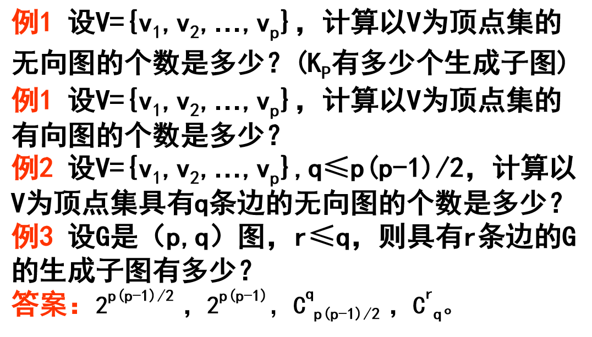

# 图论 #

## 1.基本概念

### 基本定义

- **图**: 由点和线组成的图表称之为图。
- **无向图**: 就是有限非空集 V 以及 V 上的一个 **反自反** 且 **对称** 的二元关系组成的 **关系系统**。二元组(V,E)称为一个无向图。记为G=(V,E).
  - 若|V|=p，|E|=q，则称G为一个(p,q)图，即G是一个具有p个顶点q条边的图。     
  - 每条边的 **两个端点没有次序**，所以 **对称**；
  - 每条边的 **两个端点必须互不相同**，所以 **反自反**。
  - 对于(p,q)图G，若q=0，即没有边, 则G称为零图。
  - (1,0)图称为平凡图。
- **多重图**：两个顶点之间可以有 **多条边**，这些边叫做多重边。
- **伪图**：允许 **环和多重边** 的存在。
- **子图**：G=(V,E)，由 **V 的非空子集** 和 **E 的子集** 组成的图，称为 G 的子图。（顶点不为空，边可空）
- **生成子图**：**包含 G 所有顶点** 的子图，叫做 G 的生成子图。
- **同构**：两图 **结点一样**，结点之间 **连线也一样**，但**结点位置**不同。
- **顶点的度**：和顶点关联的边的数目。
  - G 中顶点度的和等于边的条数的两倍。
  - 度为奇数的顶点必定有偶数个。
- **r 度正则图**：G 中 **每个顶点的度都为 r**。
  - **完全图**：每个顶点与其余顶点均连接。
  - p-1度正则图也称为p个顶点的完全图，记为Kp。在Kp中，有p(p-1)/2条边。
  - 每个三次图均有偶数个顶点。即奇数个顶点不构成3正则图;
- 设G的子图H具有某种性质，若G中不存在与H不同的具有此性质且包含H的真子图，则称H是具有此性质的极大子图。
- 设V是非空有限集，A 属于 V×V\{(v,v)|v∈V}，二元组D=(V,A)称为一个有向图。
- 可图解:

  - 握手定理推论、degv≤p-1
  - 度为奇数顶点的个数必为偶数

### 路、圈、连通图

- **通道**：通道是走过一些边和顶点所经过的路线，如果起点终点相同，称为闭通道。
  - **生成通道**: 包含G的所有顶点的通道称为G的一条生成通道。
  - **迹**：如果通道/闭通道上 **没有重复的边**，就称为迹/闭迹。
- **路**：通道/闭通道上 **没有重复的顶点**，就称为路/圈。
  
- **判断连通性**：G 有 p 个顶点，如果对 **所有不邻接的顶点对** u 和 v，都有 $$deg \, u + deg \, v \geq p-1$$，则 G 是连通的。

- **判断是否有圈**：
  - G 中 **至少有一个非孤立顶点**，且 **所有顶点的度都是偶数**，则 G 中有圈。
  - 存在 **两个不同顶点 u 和 v**，之间有 **两条不同的路** 连接，则 G 中有圈。
  
- 设G=(V,E)是一个有p个顶点的图。若对G的任两个不邻接的顶点u和v有: degu + degv≥p-1，则G是连通的。

  > 这个定理是一个充分条件，而不是必要条件，即每个顶点的度足够大时，此图必是连通的。

- 设G是一个(p,q)图，且δ(G)≥p/2，则G是连通图。

- 设G为(p,q)无向图，且q>(p-1)(p-2)/2，则G是连通 的。（充分条件不是必要条件）

### 补图、偶图

- **补图**：完全图 - G，得到 G 的补图（顶点一样，边互补）。如果 G 与补图同构，则称 G 是 **自补图**。
  - 自补图一定是完全图边数的一半
  - 若图G是自补图，则它所对应的完全图的边数一定是偶数；
  - 每个自补图都有4n或4n+1个顶点。
- **偶图**：G 的顶点集 V 有一个二划分 {V1,V2}，使得 **G 的所有边都满足：两个端点分属 V1 和 V2**.
  - G 为偶图的充要条件是 **所有圈的长度都是偶数**。（圈包括的边数为长度）

### 欧拉图、哈密顿图

- **欧拉图**：包含图的 **所有顶点和所有边的闭迹** 称为欧拉闭迹，存在欧拉闭迹的图叫做欧拉图。
  - (1)包含图G的所有顶点和边的迹称为欧拉迹。
    (2)包含图G的所有顶点和边的闭迹称为欧拉闭迹。
    (3)存在一条欧拉迹的图称为半欧拉图。
  (4)存在一条欧拉闭迹的图称为欧拉图。
    显然，半欧拉图、欧拉图一定是连通的。
  - G 是欧拉图 $$\Leftrightarrow$$ G 是 **连通的 & 每个顶点的度都是偶数**。
  - 欧拉图的边集能划分为若干 **边互不相交的圈**。
  - G 有一条欧拉开迹 $$\Leftrightarrow$$ G **是连通的且最多有两个奇度顶点**。
  - 设G是连通图，G恰有2n个奇度数顶点，n≥2。则G的全部边可以排成n条开迹，而且至少有n条开迹。
- **哈密顿图**：包含 G 的所有顶点的路叫做生成路，又叫哈密顿路；**包含所有顶点的圈称为 G 的一个哈密顿圈**，具有哈密顿圈的图叫做哈密顿图。
  - 显然，有哈密顿路的图是连通图；每个哈密顿图是连通的，并且每个顶点的度≥2。
  - G 有 p 个顶点，对所有不邻接的顶点对 u,v 都有 $$deg \, u + deg \, v \geq p-1$$，则 G 是哈密顿图。
  - 设G是一个有p个顶点的图，p≥3。若δ(G)≥p/2，则G是一个哈密顿图。
  - 设G是有p(p≥3)个顶点的图。若对G的任一对不邻接的顶点u和v，均有degu+degv≥p，则G是一个哈密顿图。

- **匹配**:若Y⊆E且Y中任两条边都是互相独立的，则称Y为G的一个匹配。
- **完全匹配**: 若存在一个匹配Y，使得|Y|=min{|V1|,|V2|}，则称Y是偶图G的完全匹配。若|V1|＝|V2|，则称Y为G的一个完美匹配。
- 任何r-正则偶图G=(V1∪V2,E)必有一个完美匹配，其中r≥1。
- 定理1 设G=(V1∪V2，E)是一个偶图，|V1|≤|V2|。则G中存在从V1到V2的完全匹配对于V1中任意k个顶点(k=1,2,…,|V1|)至少与V2中的k个顶点相连接。

# 树

- 连通且无圈的无向图称为(无向)树，记为T。
- 无圈的无向图称为(无向)森林。
- 设G=(V,E)是连通图，v∈V，则              数e(v)=max{d(v,u)}称为v在G中的偏心率。
    数r(G)=min{e(v)}称为G的半径。
    满足r(G)=e(v)的顶点v称为G的中心点。G的所有中心点组成的集合称为G的中心，G的中心记为C(G)

### 生成树

- 定义：作为 G 的生成子图的树，叫做 G 的生成树。
- **顶点连通度**: 设G=(V,E)是一个连通图，S⊆V，如果G-S不连通，则称S分离图G。要想从G中得到一个不连通图或平凡图，所需要从G中去掉的最少顶点数称为G的(顶点)连通度。记为k(G)或k。
- **边连通度**:  设G=(V,E)是一个无向图，要想从G中得到一个不连通图或平凡图所需要从G中去掉的最少边数称为G的边连通度。记为λ(G)或λ。
- **连通度<= 边连通度 <= 最小度**, 对任一图G，有k(G)≤λ(G)≤δ(G)。
  - 对任意非负整数a,b,c，0≤a≤b≤c，存在一个图G，使得k(G)=a,λ(G)=b,δ(G)=c。
- G 有生成树的充分必要条件是 **G 为连通图**。
  - G 为连通图，则 **边数 >= 顶点数-1**.
- Cayley 公式——计算完全图的生成树个数：具有p个顶点的完全图有 $$p^{p-2}$$ 个生成树。
- 设 T1、T2 是两棵生成树，属于 T1 但不属于 T2 的边的条数称为 T1、T2 的距离，记为 d(T1,T2)=k.
- 基本树变换：**用只属于 T2 的一条边替换掉只属于 T1 的一条边**，叫做从 T1 到 T2 的一个基本变换。设 T0 和 T 是两棵距离为 k 的生成树，则从 T0 变到 T 需要经过 k 次基本树变换。
- 最小生成树算法：（p 为顶点数，q 为边数）
  - Kruskal：$$O(qlogq)$$
  - Prim：$$O(p^2)$$

### 割点、桥、割集

- 割点：去掉顶点 v 之后 **支数大于原树**，则 v 为割点；
- 桥：去掉边 x 之后 **支数大于原树**，则 x 为桥。
- 定理：
  - 非平凡连通图 **至少有两个顶点不是割点**。（度为 1 的顶点）
- 割集：G=(V,E), S 为 E 的子集，如果 **去掉 S 中所有边** 得到的支数大于原图，而 **去掉 S 中部分边** 却不是，则称 S 为一个割集。
- 定理：
  - 设 G 有 k 个支，则去掉割集后有 k+1 个支。

# 有向图

### 有向路 & 有向圈

- 有向迹：有向通道如果 **没有重复的弧**，就称为有向迹。起点和重点相同的迹称闭迹。
- 有向路：有向通道如皋 **没有重复的顶点**，就称为有向路。
- 可达关系自反且传递，但未必对称。

- 强连通：如果有向图的 **任意两个顶点都互达**，则称强连通。

定理：有向图有 **有向圈** 的充要条件是 **存在一个子图，该子图中所有顶点的入度和出度均大于零**。

### 有向树 & 有序树

- 有根树：如果有向树 **只有一个顶点入度为 0，剩余顶点的入度都为 1**，则称为有根树。
  - 定理：有根树有一个顶点可以到达其他所有顶点，且没有弱圈。
- 有序树：如果有根树的每个顶点的子结点都排定了顺序，则称为有序树。
- 正则m元有序树：有序树的每个顶点的出度不是 0 就是 m。
- 比赛图：任意两个顶点之间有且仅有一条弧。
- 每一个比赛图都有 **生成有向路**。

# 平面图 & 图的着色

### 平面图

- 定义：一个图如果能画在平面上，且 **边只在顶点处交汇**，而在其他地方各边互不相交，则称此图为平面图。
- 面：平面图的边把平面分成了若干个区域，这些单连通的区域叫做面。
- **欧拉公式**：平面连通图 G 有 p 个顶点、q 条边、f 个面，则有 **p-q+f=2**.
  - 推论：若平面连通图 G 有 p 个顶点、q 条边，且每个面都由长度为 n 的圈围成，则有 **q=n(p-2)/(n-2)**.
  - 推论：平面图 G 有 p 个顶点、q 条边，且每个面都是三角形，则 **q=3p-6**.(最大可平面图)

### 图的顶点着色

- n-着色：顶点着色是指对每个顶点指定一种颜色，使得每两个邻接的顶点颜色都不同。n-着色是指用 n 种颜色对 G 着色。
- 色数：颜色相同的顶点组成一个 **色组**，**色数** 是指能为图着色的最小颜色数。
  -** 结论：**
  - p 个顶点的完全图，色数为 p。
  - Km,n 的色数为 2.
  - G 是偶数个顶点的圈，色数为 2.
  - G 是奇数个顶点的圈，色数为 3.

- **定理：**
  - 一个图是 **可双色的**，当且仅当它 **没有奇数长的圈**。
  - △ 表示顶点度的最大值，则 G 是 (△+1)-可着色的。
  - G 连通且不是完全图，又不是奇数长的圈，则 G 是 △-可着色的。
  - 每个平面图都是 6-可着色的。
  - 每个可平面图都是 4-可着色的。

### 图的边着色

- 定义：用 k 种颜色给每条边着色，刚好使得每对邻接的两条边都颜色不同，则称 **边色数** 为 k，G 为 k-边着色的。
- 定理：
  - p 是不为 1 的奇数，则 p 个顶点的完全图 **边色数为 p**。
  - p 是偶数，则 p 个顶点的完全图 **边色数为 p-1**。
  - G 是偶图，则边色数是 △(顶点的最大度数)。
  - Km,n 的边色数为 max{m,n}.
  - △ <= G 的边色数 <= △+1.

- (**欧拉公式**)设G是(p,q)平面==连通图==，有f个面，则p-q+f=2。
- 设G是(p,q)平面连通图且每个面都是由长为n的圈围成的，则q=n(p-2)/(n-2)。(nf=2q,p-q+f=2)

