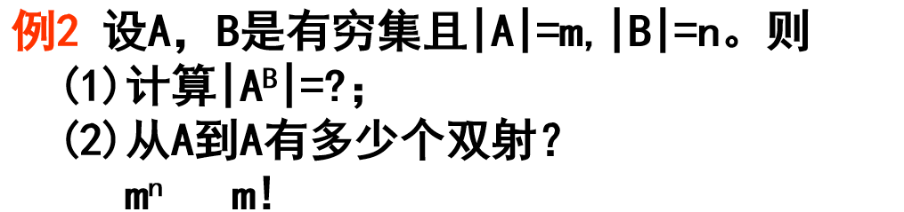
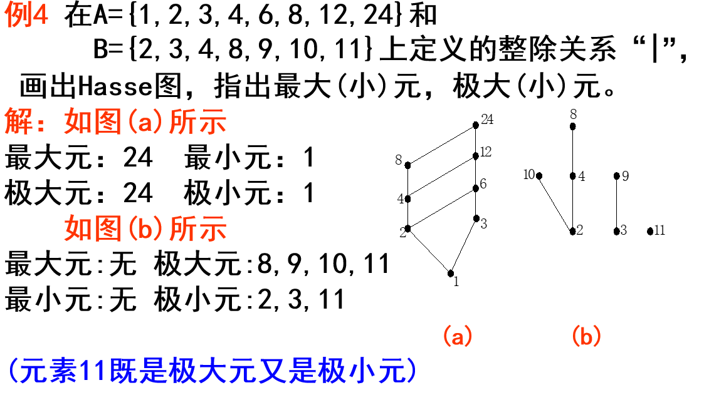

# 集合论 #

# 集合运算

[TOC]

---

**概念**

- **空集**：空集是任意集合的子集，且空集是唯一的。

- **集族**：以集合为元素的集合称为集族。

- **幂集**： 集合 **S 的所有子集**(包括空集和S本身)形成的集族称为 S 的幂集，记为 $$2^S$$。

**运算**

- 并对交的分配律：$$A \cup (B\cap C) = (A \cup B) \cap (A \cup C)$$（交对并的分配律同样满足）
- 差：A - B 记为 $$A \setminus B$$.
- 对称差：$$A \bigtriangleup B = (A \setminus B)\cup(B \setminus A)$$.

- 余集：$$A \subseteq S, A^c=S \setminus A$$.
  - 德摩根公式：
    - $$(A \cup B)^c = A^c \cap B^c$$.
    - $$(A \cap B)^c = A^c \cup B^c$$.
  - <mark>对偶原理</mark>：若有关 **并、交、余** 的某一关系式成立，如果将式中的 <mark>$\cup,\cap,\subseteq,\supseteq$</mark> 分别换成 <mark>$\cap,\cup,\supseteq,\subseteq$</mark>，并将式中 <mark>每个集换成它的余集</mark>，那么关系式依然成立。

- 笛卡尔积：$$A\times B = \{(a,b) \mid a \in A \ and\  b \in B\}$$.
  - $A*A = A^2, A*A*A=A^3,....$
  - 笛卡尔积对并、交、差, 对称差分别满足分配律。
    - $$A \times (B \cup C) = (A \times B)\cup(A\times C)$$，交差类似。

**基数**

- 记法：A 的基数记为 |A|.
- 乘积法则：|AxB|=|A|x|B|.
- |A∪B|=|A|+|B|-|A∩B|. (可能推广到n个集合)
- |A△B|=|A|+|B|-2|A∩B|.

# 映射

[TOC]

---

### 几种映射

- **部分映射**：设 $$f:A \rightarrow Y,A \subseteq X$$，则称 f 是 X 上一个部分映射。

- **单射**：设 $$f:X \rightarrow Y, \forall x,x' \in X, if\, x \ne x', \, then \, f(x) \ne f(x')$$，则称 f 为 X 到 Y 的单射。即 **自变量不同，则函数值不同**。（严格单调）. 即单射没有多对一.

- **满射**：设 $$f:X \rightarrow Y, \, \forall y \in Y, \, \exists x \in X, \, 使得 f(x)=y$$，则称 f 为从 X 到 Y 上的映射，或称 f 为满射。(对每一个函数值，都能找到自变量与之对应)

- **双射**：若 f **既是单射又是满射**，则称 f 为双射，或 **一一对应**。

- **恒等映射**：设 $$f:X \rightarrow X, \, \forall x \in X, f(x)=x$$，称 f 为 X 上的恒等映射，记为 $$I_X$$.

> 无论何时, 映射都不能一对多.

从X到Y的所有映射之集记为$Y^X$，即$Y^X=\{f|f:X →Y\}。$

> $(1+|X|)^X$个.

**抽屉原理**：n+1个物体放到n个抽屉里，则一定存在某一抽屉里面至少有两个物体。

若把m只物体放到n个抽屉里，则一定存在某一个抽屉，它里面至少有[(m-1)/n]+1个物体。

### 一般性质

- **象** 的概念：f(A)={f(x)|x∈A}，称 f(A) 为 A 在 f 下的象。(集合 A 中所有元素的函数值集合)
- **原象** 的概念：B 为 Y 的子集，则由 f 和 B 确定的 X 的一个子集 {x|f(x)∈B, x∈X}  用 $$f^{-1}(B)$$ 表示，叫做在 f 下 B 的原象。(函数值对应的自变量的集合)
- 定理：设 $$f:X \rightarrow Y, C,D \subseteq Y$$，则
  - 原象公式：$$f^{-1}(C \cup D)=f^{-1}(C) \cup f^{-1}(D)$$ (∩、△运算同样满足，象同样满足)。

> 求原象时所有分配律都成立, 但求象时便不一定.

### 映射的合成

- **定义**：设 $$f:X \rightarrow Y, g: Y \rightarrow Z$$，一个 **从 X 到 Z 的映射** h 称为 f 与 g 的合成。
- **记法**：$$f(f(x))$$ 记为 $$g\circ f$$ 或者简记为 $$gf$$。
- **映射合成交换律不成立**,即 $gf \ne fg$, 但结合律成立. (除非两个映射中有一个是恒等映射.)
- **结合律**：合成运算满足结合律，设 $$f:X \rightarrow Y, g: Y \rightarrow Z, h:Z \rightarrow W$$, 则有 $$h(gf)=(hg)f$$。
- **定理**：设 $$f: X \rightarrow Y, g: Y \rightarrow Z$$，则：
  - 如果 f,g 都是单射，则 gf 也是单射。(满射、双射同样满足)
  - ==如果 gf 是单射，则 f 是单射。==
  - ==如果 gf 是满射，则 g 是满射。==
  - 如果 gf 是双射，则 f 是单射，且 g 是满射。

### 逆映射

- **逆映射**：逆映射是反函数概念的推广。设 $$f:X \rightarrow Y$$，如果存在一个映射 $$g:Y \rightarrow X$$ 使得 $$f \circ g = I_Y \ 且 \  g \circ f = I_X$$，则 g 为 f 的逆映射。（函数和反函数，定义域和值域对应）
- **左可逆**：$$g \circ f = I_X$$，则 g 称为 f 的左逆映射。
- **右可逆**：$$f \circ g=I_Y$$，则 g 为 f 的右逆映射。
- **定理**：
  - f 可逆的充要条件是 **f 为双射**（**一一对应**）。
  - f **左可逆** 的充要条件是 **f 为单射**。
  - f **右可逆** 的充要条件是 **f 为满射**。
  - 若f左可逆，则其左逆映射未必唯一，甚至可以有无穷多个; 右可逆同理.
- **定理**：如果 f 可逆，那么 **逆映射唯一**，记为 $$f^{-1}$$.
- **定理**：$$f: X \rightarrow Y, g: Y \rightarrow Z$$ 都可逆，则 gf 也可逆，且 $$(gf)^{-1}=f^{-1}g^{-1}$$.

### 置换

- **定义**：有限集合 **S 到自身的一一对应** 称为 S 上的一个置换。如果 S 的基数为 n，则称为 n 次置换。
- **乘积**：两个 n 次置换 α 与 β 的 **合成** βα 称为乘积。计算方法就是进行两次一一对应：
  
- 注意置换不满足交换律. 但**没有共同数字** 的循环置换满足交换律，即 αβ = βα。即(1,3,4)(2,5) = (2,5)(1,3,4)
- 置换**结合律成立。**
- **逆置换**：$$\sigma^{-1}$$ 是将 σ 的 **上下两行交换** 所得的表达式。  置换与逆置换之积为恒等置换.
- **k-循环置换**：设 σ 是 S 上的一个 n 次置换，且 $$i_1\sigma = i_2, i_2\sigma = i_3,\cdots,i_{k-1}\sigma=i_k,i_k\sigma=i_1$$，则 σ 是一个 k-循环置换。k—循环置换，记为$(i_1,i_2…i_k)$;  k=2 时称为**对换**。
  - (1,2,3) 就可以表示一个 3-循环置换，表示把 1 变成 2，2 变成 3， 3 变成 1，其他不变。
  - (1,3,4)表示1=>3, 3=>4, 4=>1
  - $(i_1,i_2…i_k)$的逆是$(i_k,i_{k-1}…i_1)$; 对换的逆就是其本身。
  - **置换的循环分解定理**：每个置换都能被分解成若干个 **没有共同数字** 的循环置换的乘积，且 **分解唯一**（无视顺序）。如下:
  
  - 每个置换都能被分解成若干个 **对换** 的乘积，且 **分解不唯一**，但对换的个数的 **奇偶性一致**。
  - 若一个置换能被分解为偶数个对换的乘积，则称这个置换为偶置换。
     若一个置换能被分解奇数个对换的乘积，则称这个置换为奇置换。
  - 若循环长度K为偶数，则该循环可分解为奇数个对换的乘积；
      若循环长度K为奇数，则该循环可分解为偶数个对换的乘积。           
    **(123)=(12)(13)**,  **(1234)=(12)(13)(14)**, **(12345)=(12)(13)(14)(15)**
  - 任一置换与它的逆置换 具有相同的奇偶性.
  - n次奇置换与n次偶置换的个数相等，即 都等于$n! ∕ 2$

### 二元和n元运算 ###

- 设X,Y,Z为三个非空集合，φ:X×Y→Z。则称φ为X与Y到Z的一个二元运算，或二元代数运算。
- 设X1,X2,…,Xn,Y为非空集合，Φ:X1×X2×…×Xn →Y。则称Φ为X1,X2,…,Xn到Y的  一个n元运算。
- 

# 关系

### 概念

> 映射描述事物之间的单值依赖关系，而关系是描述事物之间的多值依赖关系，即一个事物可确定多个事物，于是X到Y的二元关系就可看成如下的一个映射。 

- **二元关系定义**：$$A \times B$$ 的一个 **子集** R 称为从 A 到 B 的一个二元关系。如果 $$(a,b)\in R$$，则称 a 与 b 符合关系 R，记为 aRb。(关系就是一些有序对之集)
  - AxB 叫做 A 到 B 的全关系；空集叫做 A 到 B 的空关系。

设R⊆X×Y，集合{x|x∈X且 存在y∈Y,使得(x,y)∈R},称为R的定义域，记为dom(R)。

集合{y|y∈Y且存在x∈X，使得(x,y)∈R}称为R的值域，记为ran(R)。

> R的定义域是R的所有序对的第一个分量构成的集合。
> R的值域就是R的所有序对的第二个分量构成的集合。

一般说来，关系中, dom(R) 属于 X，ran(R) 属于 Y。但在映射中，一定有dom(R)= X 。

**逆关系**:  设R是X上的一个二元关系，则R的逆关系$R^{-1}$为：$R^{-1}= \{(y,x)│(x,y)∈R\}$

关系图: 有关系就将两点连接起来.

### 性质

- **自反关系**：$$\forall x \in X, xRx$$，则称 X 上的二元关系 R 为自反的。（即满足 **(x,x)∈R**）
- **反自反关系**：$$\forall x \in X, (x,x) \notin R$$，则称 R 为反自反的。（如大于小于关系、父子关系）
  - 反自反的必定不是自反，不是自反的未必是反自反。
- **对称关系**：$$\forall x,y \in X, if \, xRy, \, then yRx$$，则称 R 是对称的。**(x,y) 存在，则 (y,x) 必存在**。
- **反对称关系**：$$\forall x,y \in X, \, if \, xRy \,and \, yRx, \, then \, x=y$$，那么称二元关系 R 是反对称的。若x≠y，则xRy与yRx不能同时成立;
  - 恒等关系是对称的，也是反对称的；$$\subseteq, \leq$$ 是反对称的。
- **传递关系**：$$\forall x,y \in X, \, if \, xRy \, and \, yRz, \, then \, xRz$$，则称 R 为传递关系。
- **相容关系**：如果 R 是 **自反的 & 对称的**，那么 R 称为相容关系。
- **等价关系** 若R是自反的、对称和传递的，则称R是X上的等价关系。
- **偏序关系**: 若R是自反的、反对称和传递的，则称R是X上的偏序关系。
- **二元关系的运算**：因为二元关系本质上是 AxB 的一个子集(是一个{(x,y)}集合)，所以集合的运算都适用关系间的运算。

### 关系的运算（性质） ###

> 两个传递关系, **R∪S**不一定是传递的; 也不一定不传递的

### 合成运算

- 定义：设 R:A→B，S:B→C，R 与 S 的合成 $$R \circ S$$ 是 A 到 C 的一个二元关系。且 $$R \circ S = \{()\mid(x,z)\in A \times C, and \, \exists y \in B, make \, xRy \, and \, yRz\}$$.
- **运算定理**：
  
  - 合成运算满足 **结合律**。
  - 合成运算满足 **对 ∪ 运算的分配律**，即 $$R_1 \circ (R_2 \cup R_3)=(R_1 \circ R_2)\cup(R_1 \circ R_3)$$.
  - $$R_1 \circ (R_2 \cap R_3) \subseteq (R_1 \circ R_2)\cap(R_1 \circ R_3)$$.
  - **不满足** 对 $$\setminus$$ 运算的分配律。
- **定理**：
  
  - R 是 **传递** 的 $$\Leftrightarrow$$ $$R \circ R \subseteq R$$.
  - R 是 **对称传递** 的 $$\Leftrightarrow$$ $$R = R \circ R^{-1}$$
  - (1)若R，S是反自反，则R·S不一定是反自反的；
    (2)若R，S是对称的，则R·S不一定是对称的；
    (3)若R，S是反对称，则R·S不一定是反对称的；
    (4)若R，S是传递的，则R·S不一定是传递的。
    (5)==若R，S都是自反的，则R·S是自反的==；
  - 关系的幂: $            R^{2n}=R^2，R^{2n+1}=R^3，n≥1。$

> 故R+只需求出前三个即可.

### 关系的闭包

- **传递闭包**：R 是 X 上的一个二元关系，**X 上一切包含 R 的传递关系的交** 叫做 R 的传递闭包，记为 $$R^+$$.

  - **定理**： 
    - 传递闭包是传递关系。
    - $$R^+ = R \cup R^2 \cup \cdots$$.
    - $$R \subseteq R^+$$.
    - $$(R^+)^+ = R$$.
    - $$(R \cup S)^+ \supseteq R^+ \cup S^+.$$

- **自反传递闭包**：X 上的一切包含R的自反传递二元关系，记为 $$R^*$$.

  - 自反传递闭包是自反传递的二元关系。
  - $$R^*=R^{\circ} \cup R^+$$.

## 等价关系

- **定义**：集合 X 上的二元关系 R 称为 **等价关系** 要满足三个性质：(用符号 $$\cong$$ 表示等价关系)
  - R **自反**：xRx.
  - R **对称**：若 xRy，则 yRx.
  - R **传递**：若 xRy,yRz，则 xRz.

- **等价类**：$$\cong$$ 为 X 上一个等价关系，x 为 X 的元素，则 {y|y∈X 且 x $$\cong$$ y} 称为 x 的等价类。(和 x 等价的集合)

- **划分**：把 X 分成若干个 **互不相交** 且 **覆盖** X 的子集，这些子集叫做 X 的一个划分。(划分可以是任意的)

- 设R是非空集合X上的一个等价关系，以R的不相交的等价类为元素构成的集合称为X在R下的商集，简称为X的**商集**，记为X/R，即X/R={[x]|x∈X}。
  

- 定理：设 $$\cong$$ 为 X 上的一个等价关系，则它的 **所有等价类的集合** 是 X 的一个划分，这个集合叫做 **X 对 $$\cong$$ 的商集**，记作 $$X/\cong$$.

- 对非空集合X上的任意一个等价关系R，X的商集X/R就是X的划分。 这个划分称为由等价关系R诱导出来的X的划分，记为∏R。

  > 商集是划分的一种, 划分内每组元素之间都满足关系R; 注意此R必须是等价的;

- 集合X上的划分∏和X上的等价关系R之间可以建立一一对应关系。在X上给出的一个划分与给出的一个等价关系是没有什么实质区别的。
  
  
- 关系R的等价(自反、对称、传递tsr( R))闭包，记为e(R); 
  
  
- **定理**：设 R、S 是 X 上的等价关系，则
  
  - $$R \circ S$$ 是等价关系的充要条件是 $$R \circ S = S \circ R$$.
  - $$R \circ S$$ 是等价关系，则 $$R \circ S = (R \cup S)^+$$.

> 常见等价关系: 三角形相似/全等;
>
> 整数集Z上定义的“相等”，“模n同余”关系都是等价关系

## 偏序关系

- **定义**：二元关系 R 作为偏序关系需要满足三个条件：
  - 自反
  - 反对称
  - 传递

### 最大(小)元素、极大(小)元 ###

(1)若∃a∈B,使得x∈B，均有x≤a，则称a为B的   最大元素。
(2)若∃a∈B,使得x∈B，均有a≤x，则称a为B的   最小元素。
(3)存在a∈B，若B中没有任何元素x，满足a≠x且a≤x，则称a为B的极大元。
(4)存在a∈B，若B中没有任何元素x，满足a≠x且x≤a，则称a为B的极小元。

1.最大(小)元不一定存在，若存在必唯一。
2.在非空集合中,极大(小)元必存在,但不一定唯一。

> 最大元一定是极大元, 但反之则不成立;

### 上(下)界、上(下)确界 ###

定义2 设(A,≤)是一个偏序集，B⊆A，则
(1)若存在a∈A，使得 任意x∈B，均有x≤a，则称a为B的上界；
(2)若存在a∈A，使得任意x∈B，均有a≤x，则称a为B的下界； 
(3)若B的一切上界元素形成的集合中有最小元素，则称此最小上界为B的上确界，记为sup(B)；
(4)若B的一切下界元素形成的集合中有最大元素，则称此最大下界为B的下确界，记为inf(B)。

>   1.B的上(下)界和上(下)确界可能在B中,可能不在B中,但一定在A中。
>   2.上(下)界不一定存在，若存在不一定唯一。
>   3.上(下)确界不一定存在，若存在必唯一。

### 全序关系与全序集 ###

定义1设(A,≤)是偏序集，若任意x,y∈X，x≤y与y≤x至少有一个成立，则称偏序关系“≤”为A上的全序关系，或称为线性序关系。

具有全序关系的集合A称为全序集或线性序集，记为(A,≤)。

> 集合内任意两个元素都满足关系;
>
> N上的整除关系不是全序关系, 但大小比较是全序关系;

### 链与反链 ###

定义2 设(A,≤)是一个偏序集，B⊆A，则                   
 (1)若任意x,y∈B，x≤y与y≤x必有一个成立，则称B为A的一个链，B中元素的个数称为链的长度。
 (2)若任意x,y∈B，x≤y与y≤x均不成立，则称B为A的一个反链，B中元素的个数称为反链的长度.

# 无穷集合及其基数 #

-  **对等**: 设X,Y是两个集合，若X与Y之间存在一个一一对应，则称X与Y对等，记为X～Y。
- 凡能与自身的一个真子集对等的集合称为**无穷集合**(无穷集)——无穷集合的本质。
- **可数集：如果自然数集 N ＝{1,2,…,n,…}到集合 X 存在一个 **一一对应**，则称 X 是 **无穷可数集合**，简称 **可数集**。可数集/不可数集都是 **针对无穷集合而言** 的。

> 整数集, 偶数集都是可数集;

- 若X不是可数集且也不是有限集，则称X为不可数的无穷集，或**不可数集**。

- 定理：

  - 无限集必包含可数集。
  - 可数集的任意无线子集也是可数集。
  - 可数集∪有限集结果是可数集。
  - 可数个可数集之并仍然是可数集。
  - 全体有理数是可数集。(但实数不是, 实数包括有理数和无理数)
  - 区间[0,1]中的一切有理数之集是可数集
  - 可数集的笛卡尔积是可数集。

- 基数：

  - 集合 A、B 的基数被认为相等 $$\Leftrightarrow$$ A ∽ B。

  - α、β 是 A、B 的基数，如果 A 与 B 的一个真子集对等，但是不与 B 对等，则称 α<β。

    - $$\alpha\leq\beta \Leftrightarrow$$ 存在单射 f:A→B。
    - $$\alpha < \beta \Leftrightarrow$$ 存在单射 f:A→B，且不存在 A 到 B 的双射。

    

### 连续统集 ###

- **不可数无穷集合**: 区间[0,1]中的所有实数构成的集合是不可数无穷集合。
- **连续统** : 凡与[0,1]对等的集合称为具有“连续统的势”的集合，简称连续统。
  - 设a与b为实数且a<b，则区间[a,b]中的一切实数之集（仍记为[a,b]）是一个连续统
  - 至多可数个连续统的并仍为连续统;
  - 至多可数个连续统的笛卡尔积仍为连续统;
  - 连续统个连续统之并仍然是连续统
  - 全体实数之集R是一个连续统

### 基数及其比较 ###

- 集合Ａ与集合Ｂ的基数相等 等价于Ａ～Ｂ
- 设A、B为任意两个集合，则
  (1) 若存在从Ａ到Ｂ的单射，则称Ａ的基数小于或等于Ｂ的基数，记为|A|≤|B|；
  (2) 若存在从Ａ到Ｂ的单射，但不存在一一对应，则称Ａ的基数小于Ｂ的基数，记为|A|<|B|。
- 设A,B,C是三个任意的集合，则
  (1)若A⊆B，则|A|≤|B| ；
  (2)若|A|≤|B|，|B|≤|C|，则|A|≤|C|；
- 设A是无穷集合，则|N|≤|A|。(无穷集合中最小的就是可数集, 可数集的基数大小都相等;)
- （Cantor）设A是任意一个集合，则|A|<|2A|
  - Cantor定理告诉我们：对任意的集合A，总存在比基数|A|更大的集合，也就是说：不存在最大的集合。

